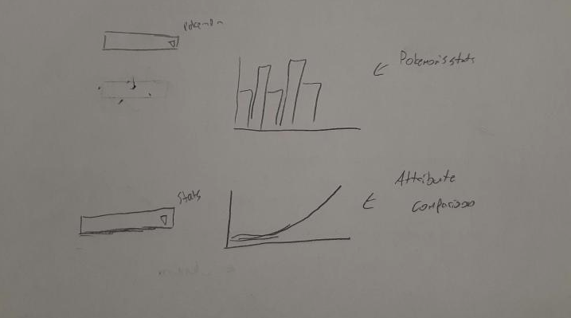

# 520-Project-Prasanna-Catriel-Obadia

This project uses pokeapi.co to gather, compare and visualise Pokemon stats.

The user is presented with a list of every Pokemon available. After selecting one, the user can compare that Pokemon's stats to the others' using a variety of different graphs.

## Performance

Tests were performed on the render deployment.

On an unthrottled network, the site loads in ~2500 milliseconds. Caching the page brings subsequent loads to ~1000 milliseconds. The largest wait is for the background and favicon which takes ~700 milliseconds uncached.

On a fast 3G network, the site loads in ~12 seconds. Caching the page brings subsequent loads to ~2.5 seconds. The largest wait is for the background which takes ~3 seconds uncached.

Chrome's lighthouse gives the website a performance rating of 88. It has a time to interactive of 1.7 seconds.
